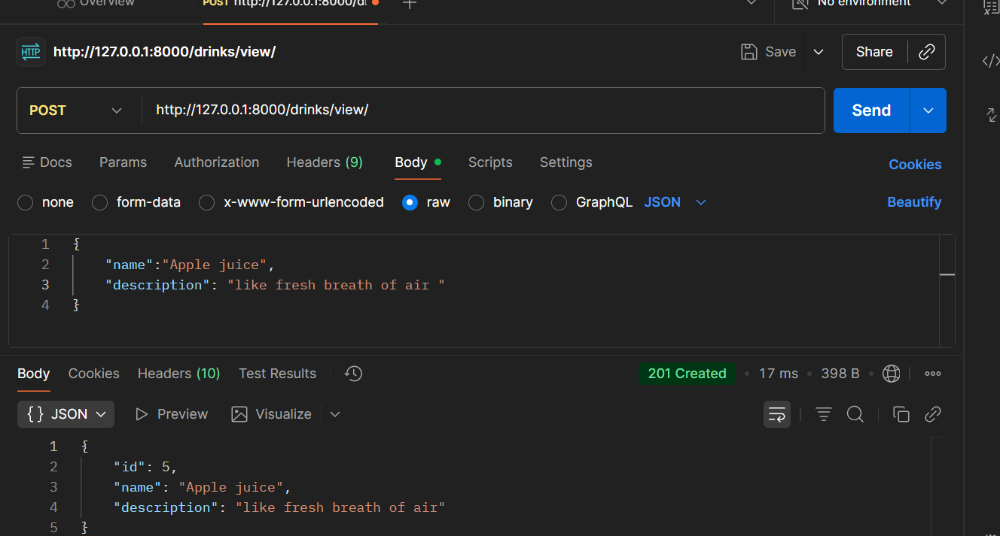
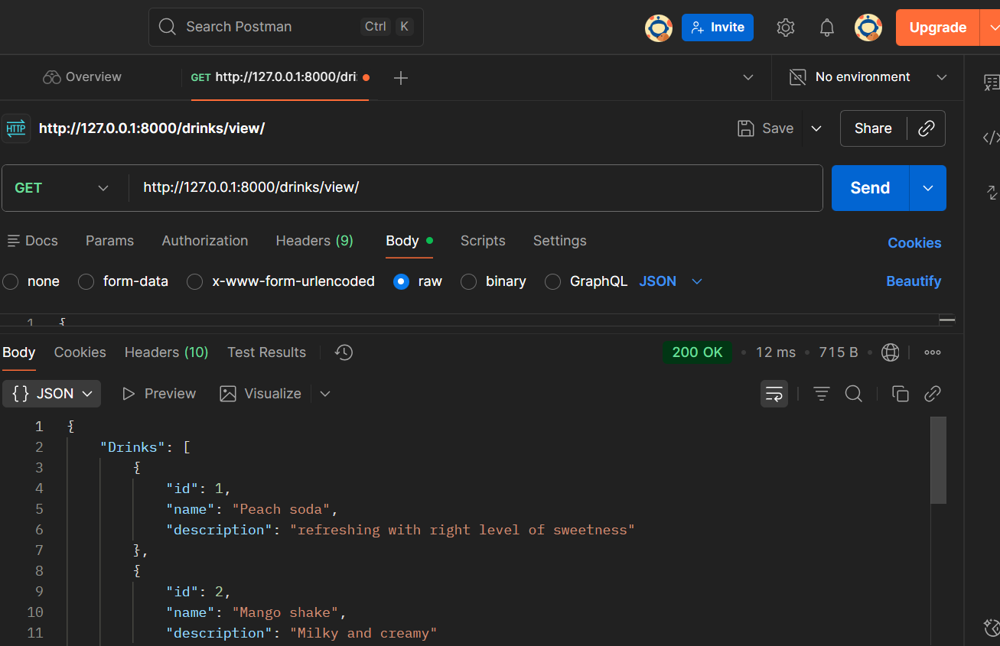
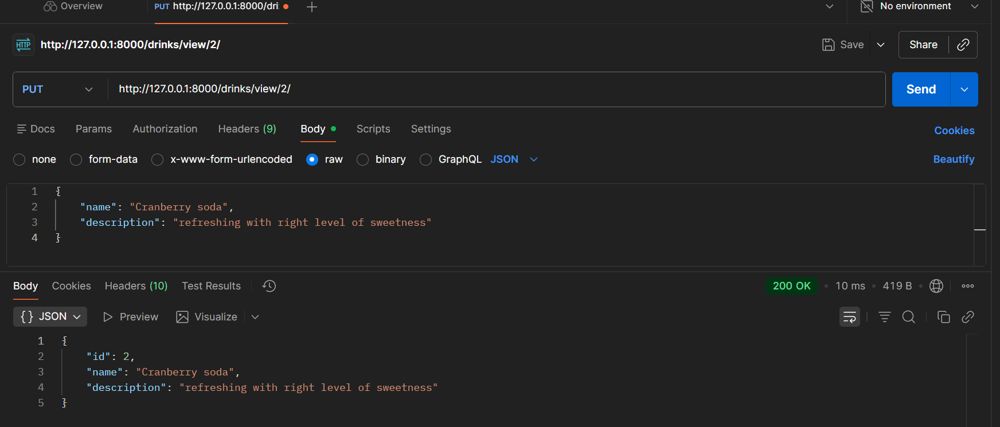
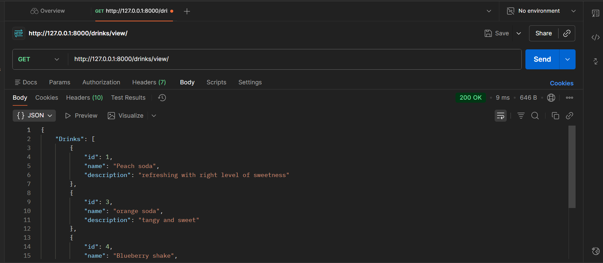

# Django REST Framework – Basic CRUD API
## This is a small learning project built to understand the fundamentals of the Django REST Framework (DRF) and how APIs work.

## How my project works:

- First, run the server using:
python manage.py runserver
This will start your app at http://127.0.0.1:8000/.

- Open that link in the browser, then go to:
http://127.0.0.1:8000/drinks/view/
This endpoint shows a list of drinks (name and description) in JSON format.

- I used Postman to test different HTTP methods such as GET, POST, PUT, and DELETE for each endpoint.

- I used DRF’s Response class, which also displays a clean and readable API UI when viewed in the browser.

- To view or delete a specific drink, use:
http://127.0.0.1:8000/drinks/view/<id>/

## Outputs:

- post method

- Get method

- Put method

- Delete method

- Get after deletion

