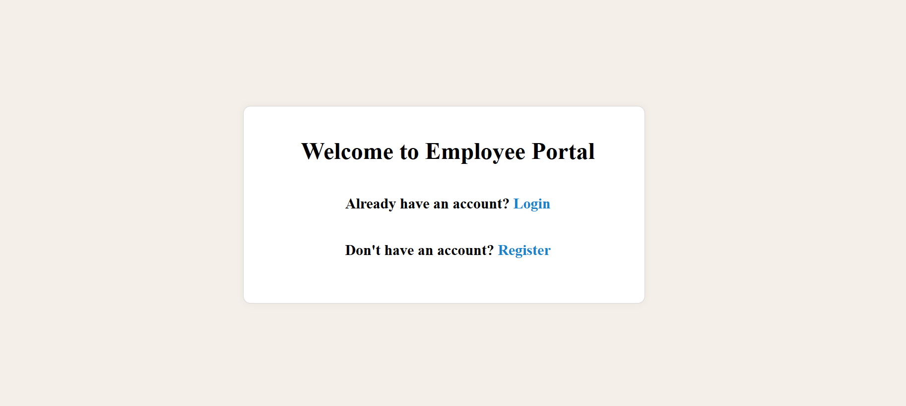
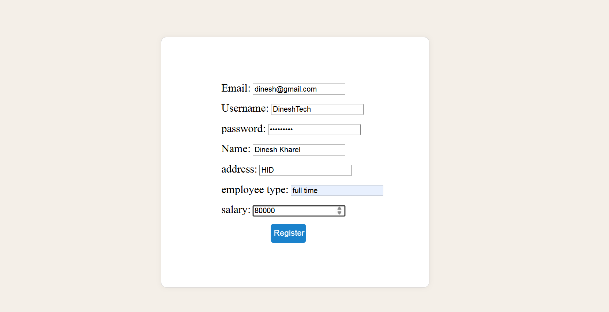
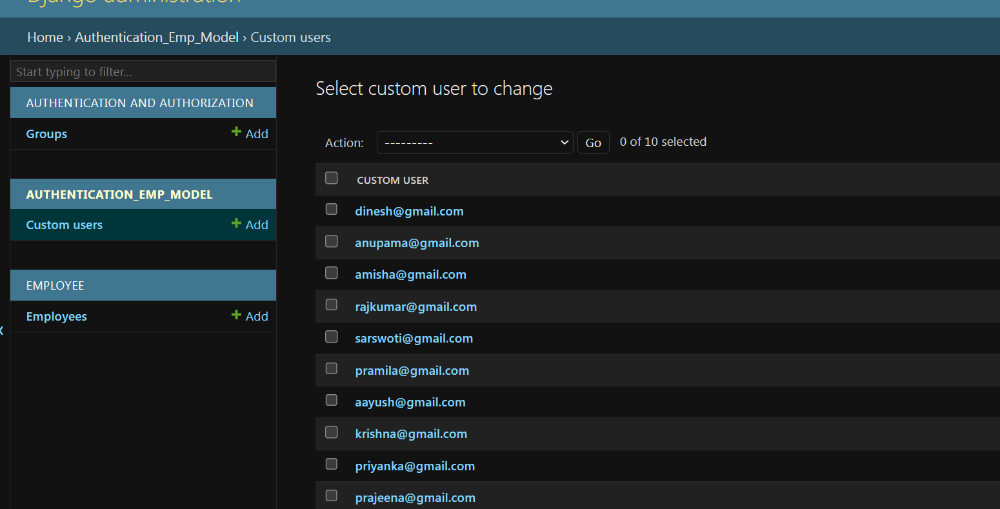
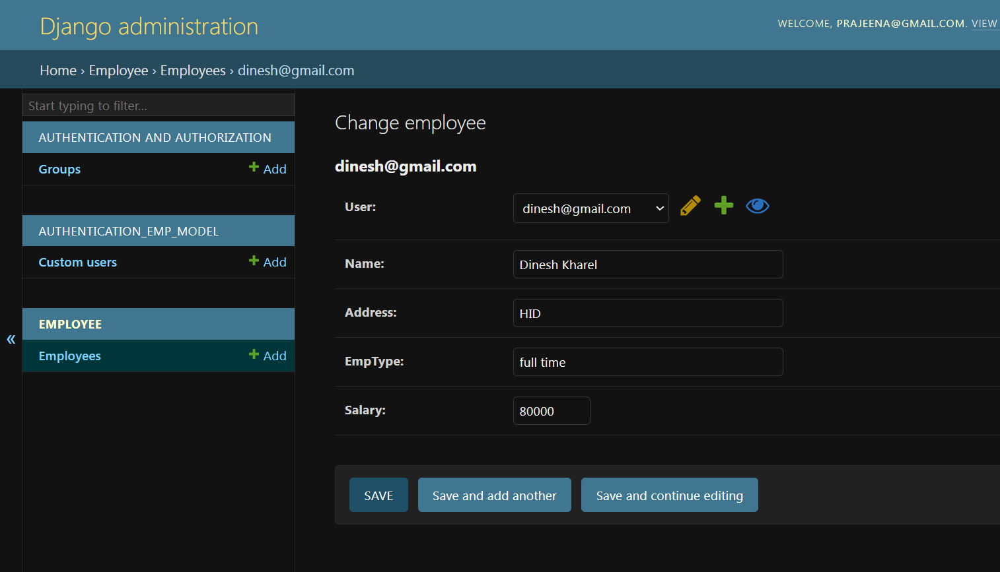
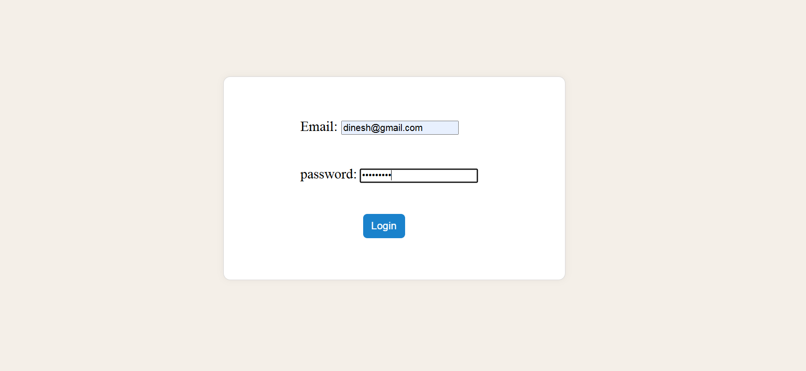
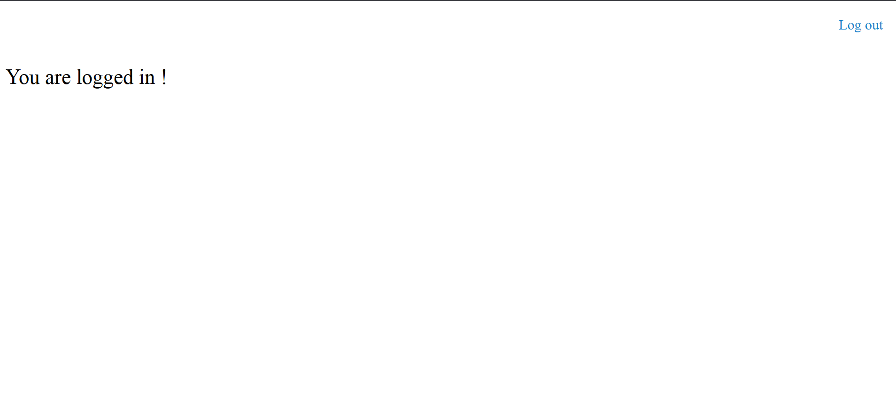
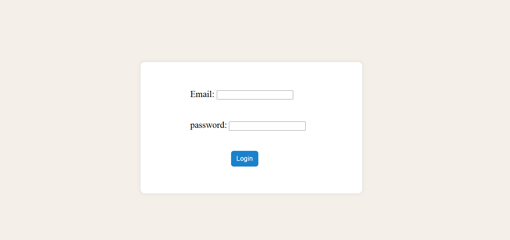

# This project is made in order to practice custom user model 

## How my project flows:

- First landing page is shown , if you have an account then you can log in . If you don't have an account then you need to register. After registering you are redirected to login page where you need to enter your credentials 
- After login you will be redirected to the main page . Since it's for practice there is only one button on nav bar for logging out . 
- You can click on logout to get out of that page . Then you will be again redirected to Login page.

## How my project works:

- **CustomUser Model**:
  - Defined in `authentication_emp_model.models`.
  - Uses `AbstractBaseUser` and a `CustomManager` to handle user creation.
  - Email is the primary login field (`USERNAME_FIELD = 'email'`).

- **Authentication**:
  - Uses Django’s built-in `authenticate`, `login`, and `logout`.
  - Views handle redirection and rendering templates.

- **Security**:
  - `@cache_control` decorator prevents browser caching of the main page after logout.

- **Employee Model**:
  - The existing `Employee` model in the `employee` app is linked to `CustomUser` using a `OneToOneField`.
  - This ensures each user has an associated Employee record.

## Project review

### Landing page
 

### Register page 

### Django admin: After registration

### Django admin: Employee record

### Login page

### Main page

### After clicking logout

