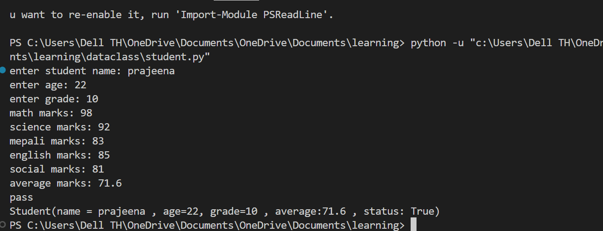

# Student.py
This project takes student data such as name , age , grade , marks. Then it calculates the average and check if a student passed or not

## How the program works 

* First the program asks to enter name , age , grade and marks for 5 subjects
* The program creates an object of dataclass named 'student' and the entered data are passed 
* The __init__(self) method initializes the necessary data 
* The object instance is use to call calculate_avg() and passed() method. Also ,__str__() method is defined to show student data by printing the instance of dataclass itself

## How to run the game

1. Make sure you have python installed
2. Save the script as student.py
3. Run it using:
   python student.py
4. Enter your data

# Output

