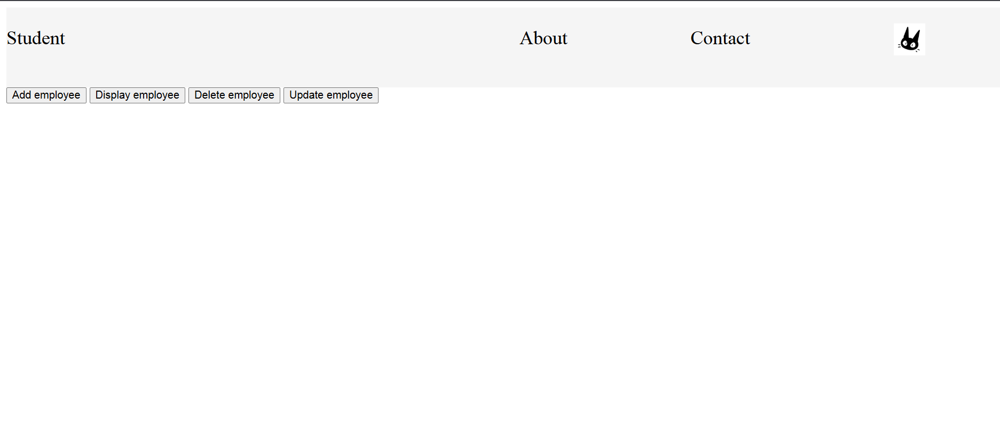
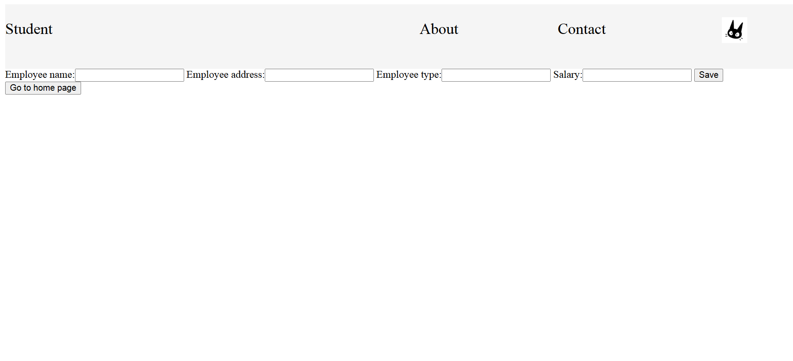
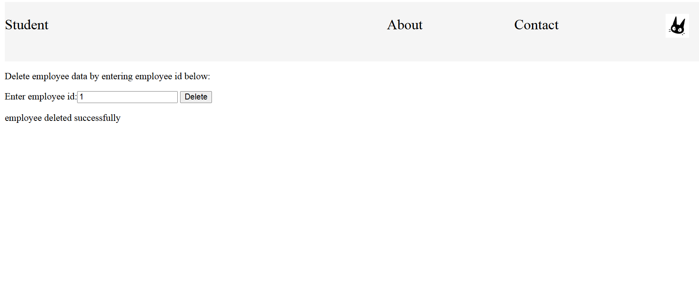
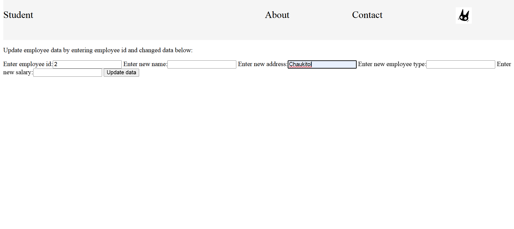

# This project is made to practice CRUD operation using django

## How my project flows:

- First a main page is loaded where there are 4 buttons with options such as add , update , delete , display
- If you choose `add employee` button then you are redirected to the page where you can enter employee data such as name , address , salary and employee type 
- If you choose `display employee` button then all the employee data from database is shown 
- If you choose `delete employee` button then you are redirected to the page where youv are asked to enter the id of the employee you wish to delete. After entering emp_id , click delete button to delete that specific employee record.
- If you choose `update employee` button then you are asked to enter emp_id along with other info you wish to update. After clicking update you can check if the data was updated or not by using `display employee` button.

## Project preview:

### Main page 

### After choosing add option

### After choosing display option

### After choosing delete

### After choosing update

